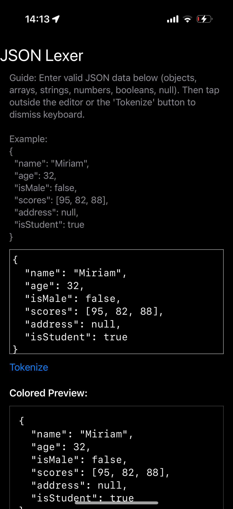
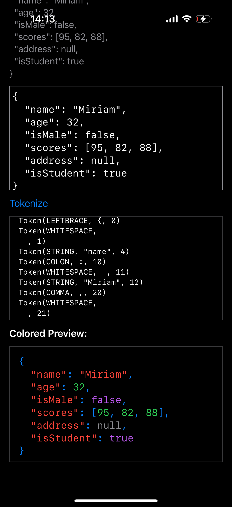

# Lexer Scanner

### Course: Formal Languages & Finite Automata

### Author: Crudu Alexandra

## Theory

The term lexer originates from lexical analysis, a critical first stage in compilers and interpreters responsible for processing strings into meaningful tokens. Lexical analysis involves reading characters from input and categorizing them into lexical units (tokens) such as identifiers, literals, operators, and punctuation. While lexemes represent the exact substrings derived from the input, tokens classify these lexemes into identifiable categories for further processing.

Lexers are fundamental for parsing structured data formats, programming languages, and markup languages. In this specific project, the lexer tokenizes JSON input, effectively categorizing elements like strings, numbers, booleans, null values, braces, brackets, colons, commas, and whitespace, forming the basis for structured data handling and syntax highlighting.

## Objectives

1. Understand lexical analysis and its application in tokenizing JSON.
2. Get familiar with the implementation and structure of a lexer.
3. Implement a practical lexer using Swift, suitable for tokenizing JSON input.

## UI Description

The user interface developed in SwiftUI facilitates:
- **JSON Input Area**: Allows users to input JSON strings into a monospaced text editor.
- **Tokenize Button**: Executes the lexer, initiating tokenization of the input JSON.
- **Token Display Area**: Lists all tokens identified by the lexer, showing type, value, and position.
- **Colored JSON Preview**: Dynamically highlights JSON input based on identified token types.
- **Interactive UI**: Scrollable views and tap gestures provide intuitive interaction, including automatic keyboard dismissal.

## Implementation Description

### Token.swift
Defines the fundamental structure representing tokens.

```swift
public struct Token {
    public let type: TokenType
    public let value: String   // The substring matched
    public let position: Int   // Token's start index in the input
}
```

### TokenTypes.swift
Enumerates possible token categories recognized by the lexer.

```swift
public enum TokenType {
    case leftBrace, rightBrace, leftBracket, rightBracket
    case colon, comma, string, number, boolean, null, whitespace, unknown
}
```

### JSONLexer.swift
Implements the tokenizer logic to parse JSON input into tokens.

Matches and emits whitespace tokens.
```swift
private func matchWhitespace(_ tokens: inout [Token]) -> Bool
```

Recognizes and categorizes single-character JSON tokens.
```swift
private func matchSingleChar(_ tokens: inout [Token]) -> Bool
```

Identifies string tokens, handling escaped characters.
```swift
private func matchString(_ tokens: inout [Token]) -> Bool
```

Parses numerical tokens, including integers and floating-point numbers.
```swift
private func matchNumber(_ tokens: inout [Token]) -> Bool
```

Detects boolean literals (`true`, `false`).
```swift
private func matchBoolean(_ tokens: inout [Token]) -> Bool
```

Captures `null` tokens explicitly.
```swift
private func matchNull(_ tokens: inout [Token]) -> Bool
```

Handles unrecognized or unexpected characters.
```swift
private func matchUnknown(_ tokens: inout [Token])
```

### ContentView.swift
Constructs the SwiftUI interface and manages interactions with the lexer.

Formats tokens for display.
```swift
private func formatToken(_ token: Token) -> String
```

Creates a colored text preview from tokens.
```swift
private func colorizedText(_ original: String, tokens: [Token]) -> Text
```

Extracts substrings from the input by range.
```swift
private func substring(_ s: String, in range: Range<Int>) -> String
```

### SwiftJSONLexerApp.swift
Sets the entry point of the SwiftUI application.

```swift
@main
struct SwiftJSONLexerApp: App {
    var body: some Scene {
        WindowGroup {
            ContentView()
        }
    }
}
```

## Results

The results demonstrate the functionality of the implemented JSON Lexer application.

**Initial UI State (1.PNG):**  
Shows the initial user interface. Users are presented with instructions for entering valid JSON data into a monospaced `TextEditor`. Below the guide, an example JSON snippet is pre-loaded into the editor.




**Tokenization and Colored Preview (2.PNG):**  
Displays the state after the "Tokenize" button is pressed. The identified tokens are listed clearly, showing their type, value, and position in the input string. Additionally, the JSON snippet is displayed again with syntax highlighting, visually differentiating token types through distinct colors (e.g., strings in red, numbers in green, booleans in purple, and structural tokens in blue).




## Conclusion

This Swift-based lexer scanner provides a robust and modular solution for tokenizing JSON data. With clearly separated components, including token definition, lexer logic, and UI integration, it demonstrates excellent extensibility for additional formats or languages. Practical and educational, this lexer serves as a solid foundation for exploring more complex lexical analysis tasks and compiler design concepts.
