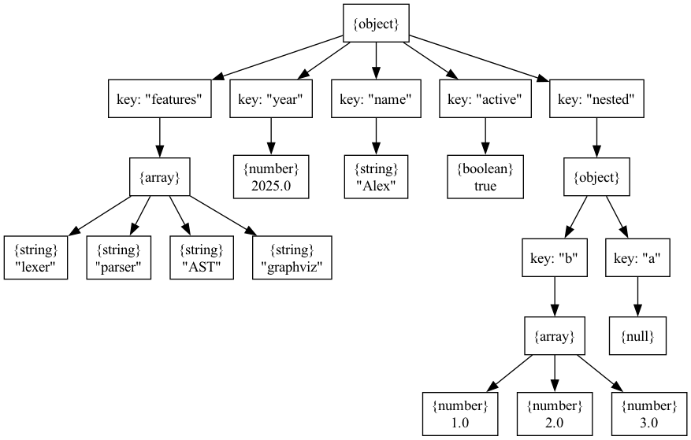

# Parser & Abstract Syntax Tree

### Course: Formal Languages & Finite Automata

### Author: Crudu Alexandra FAF-233

## Overview

The process of syntactical analysis—parsing—aims to understand and structure text based on formal grammatical rules. The result is usually a parse tree, or more abstractly, an Abstract Syntax Tree (AST). Unlike a full parse tree, an AST focuses on meaningful hierarchical structure without unnecessary grammar-related nodes, making it a practical tool for subsequent compilation phases.

In this lab work, we extend lexical analysis from Lab 3 by constructing a parser and generating an AST from JSON input. The AST is then converted to GraphViz format for visualization.

## Objectives

1. Understand parsing and its implementation.
2. Learn the concept and utility of Abstract Syntax Trees.
3. Add a `TokenType` enum to categorize tokens.
4. Use regular expressions in lexical analysis.
5. Implement AST data structures.
6. Implement a simple parser to extract syntactic structure from JSON.

## Implementation Description

### TokenType.swift

Defines an enum to categorize recognized token types.

```swift
public enum TokenType {
    case leftBrace, rightBrace, leftBracket, rightBracket
    case colon, comma, string, number, boolean, null
    case whitespace, unknown
}
```

### Token.swift

A struct for individual tokens returned by the lexer.

```swift
public struct Token {
    public let type: TokenType
    public let value: String
    public let position: Int
}
```

### JSONLexer.swift

Implements the lexical analyzer using regular expressions to match JSON elements.

Tokenizes input strings into structured tokens.

```swift
public func tokenize() -> [Token]
```

Matches strings using regular expressions.

```swift
private func matchString(_ tokens: inout [Token]) -> Bool
```

Matches numbers, booleans, nulls, symbols, and whitespace.

```swift
private func matchNumber/_Boolean/_Null/_SingleChar/_Whitespace
```

### AST.swift

Defines the data structure for representing a JSON Abstract Syntax Tree.

```swift
public indirect enum JSONValue {
    case object([String: JSONValue])
    case array([JSONValue])
    case string(String)
    case number(Double)
    case boolean(Bool)
    case null
}
```

### AST+GraphViz.swift

Converts an AST into GraphViz `.dot` format for visualization.

```swift
func graphViz() -> String
```

Traverses the AST and emits labeled nodes and edges.

```swift
emit(self, parent: nil)
```

### JSONParser.swift

Implements a recursive descent parser for JSON input.

Entry point for parsing the token list:

```swift
public func parse() throws -> JSONValue
```

Parses individual values based on token types.

```swift
private func parseValue() throws -> JSONValue
```

Handles object structures:

```swift
private func parseObject() throws -> JSONValue
```

Handles array structures:

```swift
private func parseArray() throws -> JSONValue
```

### main.swift

Brings all components together.

Reads example JSON, tokenizes it, parses it into an AST, generates GraphViz, and saves it:

```swift
let lexer = JSONLexer(input: example)
let tokens = lexer.tokenize()
let parser = JSONParser(tokens: tokens)
let ast = try parser.parse()
let dot = ast.graphViz()
try dot.write(to: path, atomically: true, encoding: .utf8)
```

## Results

An example input JSON:

```json
{
  "name": "Alex",
  "year": 2025,
  "features": ["lexer","parser","AST","graphviz"],
  "active": true,
  "nested": { "a": null, "b": [1,2,3] }
}
```

Is converted to the following GraphViz format and visual structure (example image to be inserted):

```dot
digraph AST {
  node [shape=box];
  ... (formatted AST tree)
}
```



## Conclusion

This lab builds on prior lexical analysis work by introducing syntax-aware processing and abstract tree generation. The implementation successfully tokenizes JSON, builds an AST using a recursive descent parser, and renders the structure visually with GraphViz.

Through these components, the lab provides a solid foundation for parsing and syntax analysis applicable in interpreters, compilers, and static analysis tools.
